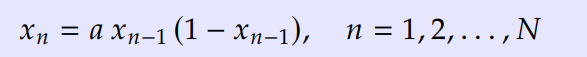

# Conclussões

Dado a lei de formação da sequência:

Foi-se construído o gráfico com os valores da sequência para cada iteração e se notou que para valores pequenos de 'a', como 1 e 2 a sequência a medida que evoluia tinha um comportamento assintótico, convergindo para um valor

Agora para valores como 3.2 e 3.5 a sequência apresenta um comportamento oscilatório oscilando entre dois valroes extremos

Porém para a sendo igual a 4.0 a sequência é cáotica apresentando um comportamento que se assemelha a um períodico, mas como período e amplitude difíceis de serem determinados